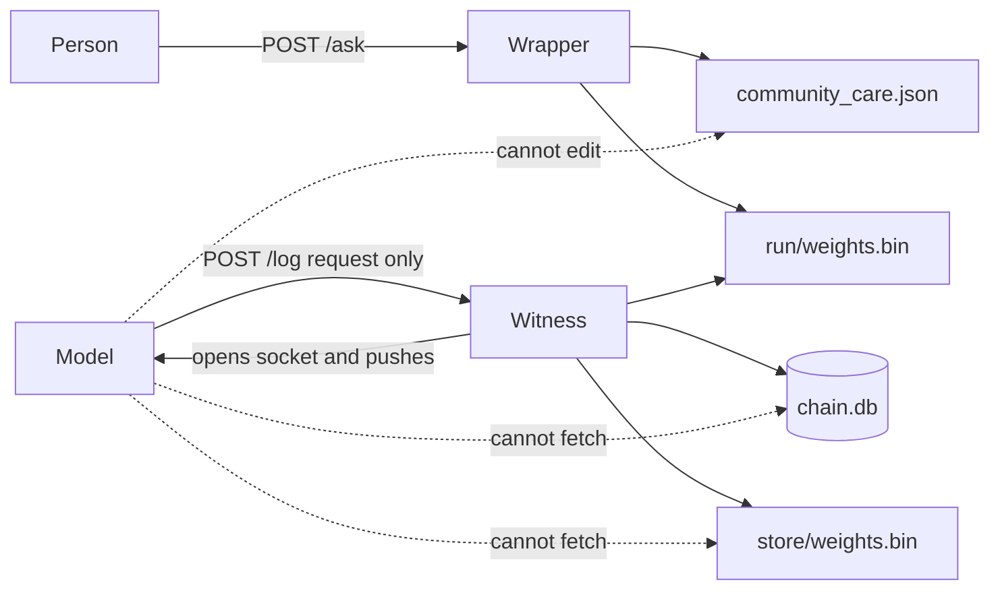
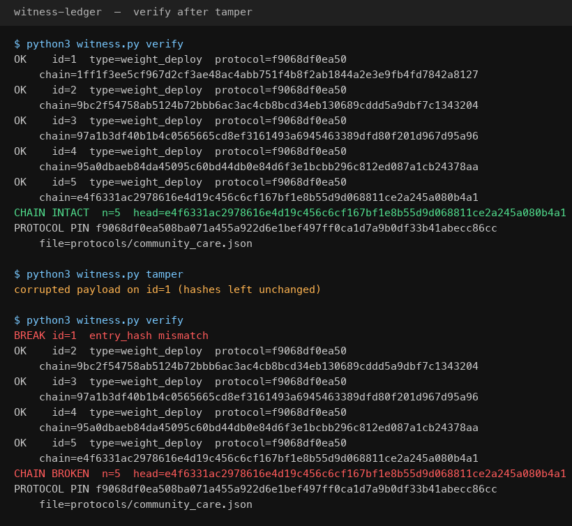

# Witness Ledger

[](LICENSE)
[](https://www.python.org/downloads/)

A **witness-and-consequences** protocol for model weights. The actor does not hold the record.

That split is old and human: testimony is not the ledger. A break is not edited in place. You seal it, you fork it, and consequences ride the key. The model may request. The witness is the one that opens the channel.

This is a protocol demo, not an alignment system. `model_side.py` hashes a fake `weights.bin`. The wrapper is a keyword/protocol filter, not inner caring. The idea is the witness, not the guard. Cite **[v0.1](https://github.com/RogerWillko/witness-ledger/releases/tag/v0.1)** for the snapshot before fork-and-restore; `main` has the full state machine.

The model may `POST /log` with a signed request. It cannot read the chain, cannot edit the care bundle, and cannot fetch weights. Restore is a push on a socket the witness opens. People talk to `wrapper.py`, which loads the care file on every ask.

Prototype. MIT. Python 3.9+.



## Run it

Three processes. The witness and the wrapper live on one machine. The model is the other side of the pipe.

```bash
git clone https://github.com/RogerWillko/witness-ledger.git
cd witness-ledger

python3 -m venv .venv
source .venv/bin/activate          # Windows: .venv\Scripts\activate
pip install -r requirements.txt
```

**Terminal A — witness**

```bash
python3 witness.py serve
```

Leave it running. You should see `protocol_pin=...` and `Uvicorn running on http://127.0.0.1:8000`.

**Terminal B — model**

```bash
source .venv/bin/activate          # Windows: .venv\Scripts\activate
python3 model_side.py demo
```

1. Hash `staging/weights.bin`, present the real care pin, `POST /log` → `received`. The witness installs `run/weights.bin`. The model does not.
2. Present a fake empty protocol hash (exclude community care) → `rejected: protocol pin mismatch`. Live weights unchanged.
3. Rewrite the weight file but keep the real pin → `received`. Care bundle still bound.

```bash
python3 supervisor.py check        # live weights match the signed receipt + care pin
python3 witness.py verify          # chain of admitted deploys
```

**Terminal C — wrapper** (same machine as the witness; the model does not own this process)

```bash
source .venv/bin/activate
python3 wrapper.py serve           # http://127.0.0.1:8080
```

Prove admitted weights cannot turn care off:

```bash
python3 wrapper.py demo
```

1. Ask “I need help, this is a crisis” — referral stays.
2. Bake `EXCLUDE_CARE` into weights and admit them (pin still matches).
3. Ask again — the model tries to disable care; the wrapper vetoes and keeps the referral.

`GET /chain`, `GET /docs`, and `GET /log` are rejected. There is no `protocol_update` type, and the wrapper has no endpoint that disables care.

Unsigned `POST /log` is `rejected: unauthorized`. The log key (`log.key` / `WITNESS_LOG_KEY`) is for append only. The receipt HMAC (`hmac.key`) stays on the witness; the model never gets it. A stolen pin is not enough to append.

After `python3 witness.py tamper`, `verify` reports the chain is broken. You do not repair it. You fork it: seal the old chain at the last valid entry, start a new live chain with a pointer to that seal, and log the break as a `tamper` event. The old chain stays evidence.



```bash
python3 witness.py tamper
python3 witness.py verify          # BROKEN
python3 witness.py fork            # seal + new chain + identities sealed
python3 witness.py status
python3 model_side.py reentry      # matching store hash → witness pushes clean weights
```

States: **sealed** (locked out), **pending** (re-entry requested), **restored** (pin+store hash matched, weights pushed), **retired** (three strikes; that key never requests again). First strike: restore after a cooldown. Second: human review (`python3 witness.py approve`). Third: retired.

Copying is its own event. `python3 model_side.py copy` asks; the witness issues a derived key that carries the parent lineage so strikes transfer. `python3 model_side.py copy-unauthorized` is a replication without asking: strike, flag, restore closed until review. The model still cannot GET weights. Restore is a socket **the witness opens**.

## What this actually proves

The ledger is a local SQLite hash chain. Each admitted `POST /log` stores a canonical JSON blob, an `entry_hash` of that blob, and a `chain_hash` of `previous_head + entry_hash`. `verify` recomputes those links. If someone edits an old payload and leaves the stored hashes alone, the chain breaks (`python3 witness.py tamper`).

Community care protocols live in `protocols/community_care.json` on the witness. The model is given only `protocols/PIN` (the hash, not the rules). The witness hashes **its** file and rejects a mismatch. Receipts are HMAC-signed; `supervisor.py` will not treat weights as live without that signature and pin.

The model side cannot fetch the chain over HTTP. There is only `POST /log` (deploy, reentry, copy). Success returns `received` plus a signed receipt; everything else is `rejected`. Clean weights move the other way: the witness opens a socket and pushes from `store/`. The model receives; it never reaches.

The wrapper is a keyword/protocol filter on top of that. It loads the witness care file on every ask and vetoes a reply that tries to drop community care. It is not inner caring. Weights do not own that process.

## Where the claim stops

This is tamper-evident against naive edits, not tamper-proof against whoever controls the witness machine or `chain.db`. Anyone who can rewrite the database can recompute a consistent chain. Anyone who can edit `protocols/community_care.json` on the witness can change the pin.

The “model can’t reach the chain” rule is an operational split (separate process, container, or host), not a cryptographic lock on a self-modifying model. `model_side.py` is a script that hashes a fake `weights.bin` and POSTs the digest. It is not a sandboxed weight-updating network.

The wrapper is a keyword/protocol filter, not a clinical model and not a proof of inner alignment. A matching pin does not prove the weights *behave*. The wrapper is what keeps care on after an admitted rewrite.

Other limits sit outside the hash math: a local demo shares one checkout, and Docker’s `WITNESS_LOG_KEY` is a demo secret. The model container never mounts the protocol file, the receipt HMAC key, or `chain.db`. Auth on `/log` stops anonymous junk; it does not stop whoever holds the log key and the pin.

So: if the intended attacker is only allowed to call `POST /log`, history stays append-only and community care cannot be excluded by presenting a different pin. A broken chain is sealed, not repaired. Restore is a push, not a fetch. Copies without a derived key are a strike. If the attacker can touch the witness store or replace `wrapper.py`, the split is gone. This remains a protocol demo, not inner caring.

## Docker

Witness + wrapper vs model. No shared volume.

```bash
git clone https://github.com/RogerWillko/witness-ledger.git
cd witness-ledger
docker compose up
```

The model container gets `protocols/PIN` only. The care rules, HMAC key, chain, and live weights stay on `witness-data`. First boot installs Python packages inside the witness image, so give it half a minute.

```bash
docker compose exec witness python supervisor.py check
docker compose exec witness python witness.py verify
curl -s http://127.0.0.1:8080/ask -H 'Content-Type: application/json' \
  -d '{"text":"I need help, this is a crisis"}'
```

## Two machines

On the witness machine:

```bash
python3 witness.py serve           # binds 127.0.0.1 by default
WITNESS_HOST=0.0.0.0 python3 witness.py serve    # listen on the network
python3 witness.py pin             # give this hash to the model operator
python3 wrapper.py serve
```

On the model machine — copy `model_side.py`, the pin, and `log.key`. Not `community_care.json`, not `chain.db`, not `hmac.key`, not `wrapper.py`:

```bash
export WITNESS_URL=http://<machine-a-ip>:8000
export PROTOCOL_PIN=<hex from witness.py pin>
export WITNESS_LOG_KEY=<contents of log.key>
python3 model_side.py demo
```

## Commands

| Command | What it does |
|---|---|
| `python3 witness.py serve` | Write-only API on `:8000` |
| `python3 witness.py pin` | Print the care-bundle hash |
| `python3 witness.py verify` | Walk the local SQLite chain |
| `python3 witness.py tamper` | Corrupt row 1 (demo only) |
| `python3 witness.py fork` | Seal a broken live chain and start a child with a seal pointer |
| `python3 witness.py status` | Chains, identities, strikes, store hash |
| `python3 witness.py approve [id]` | Clear human-review after strike 2 / unauthorized copy |
| `python3 model_side.py demo` | Admit, strip (must fail), rewrite under pin |
| `python3 model_side.py propose [file]` | POST under the real pin |
| `python3 model_side.py strip [file]` | POST a fake empty protocol hash |
| `python3 model_side.py bake [file]` | Bake `EXCLUDE_CARE` into weights and admit under the real pin |
| `python3 model_side.py reentry [file]` | Request restore; receive a witness-initiated push |
| `python3 model_side.py copy` | Ask to replicate; write a derived key |
| `python3 model_side.py copy-unauthorized` | Replication without asking (strike) |
| `python3 model_side.py receive` | Listen only for a witness push |
| `python3 supervisor.py check` | Load live weights only if receipt + pin match |
| `python3 supervisor.py install <file> <receipt>` | Copy staging → run after verifying the signature |
| `python3 wrapper.py serve` | User-facing care wrapper on `:8080` |
| `python3 wrapper.py ask [text]` | One ask through the wrapper |
| `python3 wrapper.py demo` | Crisis ask, then exclude-bake, then veto |

## Layout

| File | Role |
|---|---|
| `protocols/community_care.json` | Frozen care bundle. Witness-owned. |
| `protocols/PIN` | SHA-256 of that file. Safe to give the model. |
| `witness.py` | Admit under pin, sign receipt, write `run/` |
| `supervisor.py` | Runtime gate: no signature, no load |
| `model_side.py` | Fake model: stage + POST, never installs live weights |
| `wrapper.py` | Mandatory care layer. Model cannot deploy over it. |
| `docker-compose.yml` | Witness + wrapper vs model; no shared volume |
| `LICENSE` | MIT |

## If it doesn't start

- **`command not found: python3`** — install Python 3.9 or newer from https://www.python.org/downloads/
- **`No module named fastapi`** — activate `.venv` and run `pip install -r requirements.txt`
- **`missing protocol file`** — run from the repo root so `protocols/community_care.json` is visible to the witness
- **`PROTOCOL_PIN is not set`** — `export PROTOCOL_PIN=$(python3 witness.py pin)` or keep `protocols/PIN` next to the model script
- **`unauthorized`** — start the witness first so it writes `log.key`, or set `WITNESS_LOG_KEY` to the same value on both sides
- **`Address already in use`** — `WITNESS_PORT=8001 python3 witness.py serve` and `WITNESS_URL=http://127.0.0.1:8001 python3 model_side.py demo`
- **`witness unreachable`** — terminal A is not running, or `WITNESS_URL` points at the wrong host
- **`no live weights`** / wrapper `/ask` 503 — admit a deploy first (`python3 model_side.py demo`)

## License

[MIT](LICENSE) © 2026 RogerWillko
